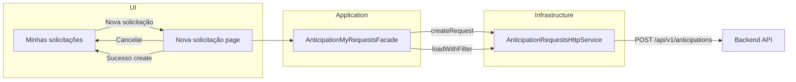

# Plano RF-5 — Criar nova solicitação de antecipação (frontend)

## 1. Resumo do entendimento (Tradutor)

**Problema de negócio:** O botão "Nova solicitação" na tela "Minhas solicitações de antecipação" (RF-1) existe mas não leva a nenhum fluxo. O backend já expõe `POST /api/v1/anticipations` (RA-1, RC-1). É necessário que Creators (e, opcionalmente, Admins) possam criar solicitações pelo frontend: formulário com valor solicitado, validação (mín. 100), submissão, feedback de sucesso/erro e atualização da lista.

**Personas:** Creator (principal — cria para si); Admin (secundário — pode criar em nome de creator via `creatorId` opcional).

**Requisitos em linguagem de sistema/UX:**

- **Navegação:** Minhas solicitações → "Nova solicitação" → tela ou modal de criação → preencher valor → Submeter ou Cancelar.
- **Formulário:** Campo "Valor solicitado" obrigatório, mínimo 100 (reais), formato monetário; opcional para Admin: campo Creator; botões "Criar solicitação" e "Cancelar".
- **Validação:** Frontend valida valor >= 100 antes de enviar; exibir mensagens junto ao campo; em erro de API (ex.: já existe solicitação em análise) exibir mensagem e código de suporte.
- **Pós-sucesso:** Mensagem "Solicitação criada com sucesso.", fechar modal ou redirecionar para Minhas solicitações e recarregar a lista.

**Critérios de aceitação (CA-RF5-1 a CA-RF5-6)** definidos na demanda são a base para testes e implementação.

---

## 2. Âmbito da análise

- **Áreas consideradas:** Frontend Angular — domínio (port), infraestrutura (HTTP), aplicação (facade Minhas solicitações), features (página Minhas solicitações, nova página/modal "Nova solicitação"), rotas.
- **Premissas:** Rota dedicada para o formulário (ex.: `anticipation/my-requests/new`) em vez de modal, para facilitar testes e a11y; campo Admin `creatorId` fica como extensão opcional (pode ser implementado numa fase posterior para reduzir escopo inicial). Unidade de valor: backend usa decimal em **reais**; frontend envia `requestedAmount` em reais (ex.: 1000 para R$ 1.000,00) e exibe conforme locale.

---

## 3. Alterações necessárias (relatório Maestro)

### 1. Domain — Estender port e tipos para criação

**Onde:** [frontend/src/app/domain/anticipation.ts](frontend/src/app/domain/anticipation.ts)  
**Tipo:** Alterar  
**Descrição:**  

- Adicionar tipo de payload: `CreateAnticipationRequestPayload` com `requestedAmount: number` (reais) e `creatorId?: string` (opcional, para Admin).  
- Adicionar tipo de retorno: `CreateAnticipationRequestResult` com `id: string`, `protocol: string`, `netAmount: number` (reais), `status: AnticipationRequestStatus` (ou string mapeável).  
- Em `AnticipationRequestsPort`, adicionar método `createRequest(payload: CreateAnticipationRequestPayload): Observable<CreateAnticipationRequestResult>`.  
**Requisito atendido:** Contrato de domínio para criação (demanda § Requisitos técnicos — Domain).

### 2. Infrastructure — POST criar solicitação

**Onde:** [frontend/src/app/infrastructure/anticipation/anticipation-requests.http.service.ts](frontend/src/app/infrastructure/anticipation/anticipation-requests.http.service.ts)  
**Tipo:** Alterar  
**Descrição:**  

- Implementar `createRequest(payload)`: `POST this.baseUrl` com body em camelCase para o backend: `{ requestedAmount, creatorId? }` (backend .NET aceita PascalCase; garantir que o HttpClient envie o que a API espera — tipicamente JSON camelCase ou PascalCase conforme config).  
- Mapear resposta 201: backend retorna `{ Id, Protocol, NetAmount, Status }` → `CreateAnticipationRequestResult` (id, protocol, netAmount em reais, status mapeado para enum de domínio).  
**Requisito atendido:** Integração com `POST /api/v1/anticipations` (demanda § Fluxo 1, Requisitos técnicos — Infrastructure).

### 3. Application — Facade Minhas solicitações: createRequest

**Onde:** [frontend/src/app/application/anticipation/anticipation-my-requests.facade.ts](frontend/src/app/application/anticipation/anticipation-my-requests.facade.ts)  
**Tipo:** Alterar  
**Descrição:**  

- Adicionar método `createRequest(payload: CreateAnticipationRequestPayload): Promise<void>`.  
- Ao chamar o port `createRequest(payload)`: em sucesso — limpar erro, definir `infoMessage` ("Solicitação criada com sucesso."), chamar `loadWithFilter(this._filters())` para recarregar a lista; em erro — usar `buildErrorPresentation` com mensagem de contexto adequada e `setErrorFromPresentation`.  
- Não fechar modal nem navegar na facade (a página/componente que chama o facade fará o redirect ou fechamento após sucesso, por ex. ao ler `infoMessage` ou um signal de sucesso). Alternativa: facade pode expor um signal `createSuccess` ou a página verificar se há `infoMessage` e então navegar; o importante é que a lista seja recarregada e a mensagem exibida.  
**Requisito atendido:** Caso de uso de criação e atualização da lista (demanda § Application).

### 4. Rotas — Rota para formulário Nova solicitação

**Onde:** [frontend/src/app/app.routes.ts](frontend/src/app/app.routes.ts)  
**Tipo:** Alterar  
**Descrição:**  

- Adicionar rota `anticipation/my-requests/new` com `AuthGuard` e `data: { requiredRoles: ['Creator', 'Admin'] }`, lazy load do componente da página "Nova solicitação".  
**Requisito atendido:** Navegação ao formulário (CA-RF5-1).

### 5. Features — Página "Nova solicitação"

**Onde:** Novo componente de página em `frontend/src/app/features/anticipation/pages/new-request/` (ou `create-request/`): `anticipation-new-request-page.component.ts|html|scss|spec.ts`.  
**Tipo:** Criar  
**Descrição:**  

- Página com formulário reativo (typed forms): campo "Valor solicitado" (obrigatório, numérico, mínimo 100, formato monetário conforme locale).  
- Validação no frontend: valor >= 100; exibir mensagem de validação (ex.: "Valor mínimo é 100") junto ao campo e não enviar se inválido.  
- Botão primário "Criar solicitação" (ou "Submeter"): desabilitado se formulário inválido ou durante submissão; ao submeter, chamar `facade.createRequest({ requestedAmount })`.  
- Botão secundário "Cancelar": navegar para `anticipation/my-requests` sem submeter (Router.navigate).  
- Área de feedback: exibir `errorMessage` e `errorSupportId` da facade (role="alert"); após sucesso, a facade define infoMessage e recarrega a lista — a página pode navegar de volta para `anticipation/my-requests` após sucesso (por ex. subscrevendo ao primeiro valor de infoMessage ou usando um signal de sucesso na facade).  
- Injetar `AnticipationMyRequestsFacade` e `Router`; não injetar HttpClient.  
**Requisito atendido:** CA-RF5-1, CA-RF5-2, CA-RF5-3, CA-RF5-4, CA-RF5-5, CA-RF5-6; componentes de UI e comportamento (demanda § Telas, Fluxos, Componentes de UI).

### 6. Features — Minhas solicitações: ligar botão "Nova solicitação" à navegação

**Onde:** [frontend/src/app/features/anticipation/pages/my-requests/anticipation-my-requests-page.component.html](frontend/src/app/features/anticipation/pages/my-requests/anticipation-my-requests-page.component.html) e `.ts` se necessário  
**Tipo:** Alterar  
**Descrição:**  

- No botão "Nova solicitacao", adicionar navegação para a rota do formulário (ex.: `routerLink` para `anticipation/my-requests/new` ou `(click)` que chama `router.navigate(['anticipation', 'my-requests', 'new'])`).  
- Corrigir texto do botão para "Nova solicitação" (ortografia) se desejado.  
**Requisito atendido:** CA-RF5-1 (botão leva ao formulário).

### 7. Testes unitários — Port / Facade / Formulário

**Onde:**  

- [frontend/src/app/domain/anticipation.ts](frontend/src/app/domain/anticipation.ts) — sem testes unitários de tipo; testes do port são nos implementadores e na facade.  
- [frontend/src/app/application/anticipation/anticipation-my-requests.facade.spec.ts](frontend/src/app/application/anticipation/anticipation-my-requests.facade.spec.ts) (se existir; senão criar spec para a facade).  
- Novo: `anticipation-new-request-page.component.spec.ts`.  
**Tipo:** Criar / Alterar  
**Descrição:**  
- **Facade:** createRequest chama o port com payload correto; em sucesso atualiza lista (loadWithFilter chamado) e define infoMessage; em erro define mensagem via setErrorFromPresentation.  
- **Página Nova solicitação:** valor < 100 marca campo inválido; valor >= 100 permite submit; Cancelar navega sem chamar o port; submissão chama facade.createRequest com payload correto.  
**Requisito atendido:** Diretrizes de testes — Unitários (demanda § Diretrizes de testes).

### 8. Testes de integração — HTTP create e facade

**Onde:** [frontend/src/app/infrastructure/anticipation/anticipation-requests.http.service.spec.ts](frontend/src/app/infrastructure/anticipation/anticipation-requests.http.service.spec.ts)  
**Tipo:** Alterar  
**Descrição:**  

- Testar POST com body `{ requestedAmount, creatorId? }` e mapeamento da resposta para `CreateAnticipationRequestResult`.  
- Opcional: teste de integração facade + componente (após create bem-sucedido, lista contém a nova solicitação ou estado atualizado).  
**Requisito atendido:** Diretrizes de testes — Integração (demanda § Diretrizes de testes).

### 9. E2E (opcional)

**Onde:** Novo ou existente spec E2E em `frontend/e2e/` (ex.: `anticipation-my-requests.e2e.spec.ts` ou adicionar cenário em spec existente).  
**Tipo:** Criar / Alterar  
**Descrição:** Creator acessa Minhas solicitações, clica em Nova solicitação, preenche valor 500, submete e vê a nova solicitação na lista (ou mensagem de sucesso e redirecionamento).  
**Requisito atendido:** Diretrizes de testes — E2E opcional (demanda § Diretrizes de testes).

### 10. Rastreabilidade

**Onde:** [docs/tracability.md](docs/tracability.md)  
**Tipo:** Alterar  
**Descrição:** Atualizar secção RF-5 com referências aos ficheiros implementados (port, HTTP service, facade, página new-request, rota, testes).  
**Requisito atendido:** Rastreabilidade (demanda § Rastreabilidade).

---

## 4. Resumo executivo

- **Total de itens:** 10.  
- **Por tipo:** Criar (2: página Nova solicitação, E2E opcional); Alterar (8: domain, infrastructure, application, routes, my-requests page, facade spec, HTTP spec, tracability).  
- **Dependências entre itens:** (1) domain → (2) infrastructure; (2)+(3) → (5) página e (6) my-requests; (3) depende de (1); (4) rota aponta para (5); (7)(8) acompanham (1)–(6). Implementação sugerida: 1 → 2 → 3 → 4 → 5 → 6 → 7 → 8 → 10; 9 opcional.

---

## 5. Diagrama de fluxo (resumo)

---

## 6. Convenções técnicas (frontend)

- Aplicar [.cursor/rules/angular-frontend.mdc](.cursor/rules/angular-frontend.mdc) e skill mestre-freire-angular: camadas domain/application/infrastructure/features, standalone, templateUrl/styleUrl, typed forms, Signals, sem HttpClient em componentes.  
- Spec antes de código: testes (unit e integração) podem ser escritos ou evoluídos a partir dos CA-RF5-x e deste plano antes da implementação de produção.

